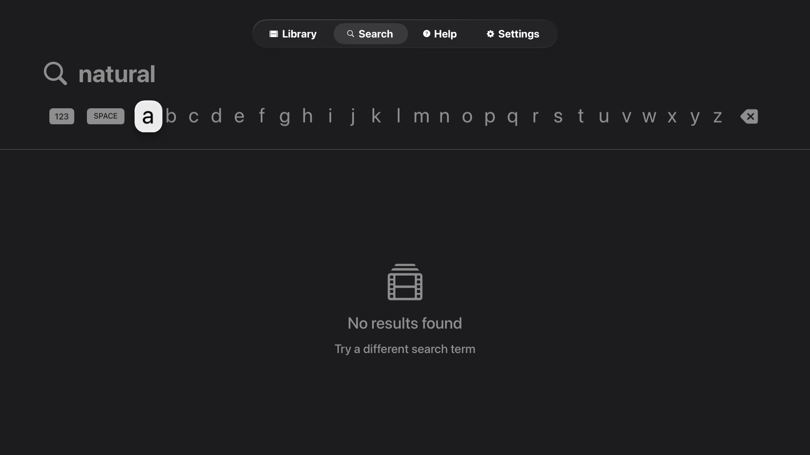
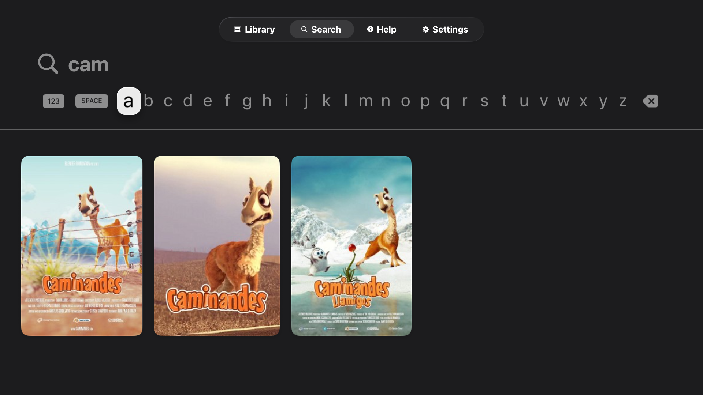

# expo-tvos-search

[](https://www.npmjs.com/package/expo-tvos-search)
[](https://opensource.org/licenses/MIT)
[](https://github.com/keiver/expo-tvos-search/actions)

A native tvOS search component for Expo and React Native using SwiftUI's `.searchable` modifier. Provides the native tvOS search experience with automatic focus handling, remote control support, and flexible customization for media apps.

**Platform Support:**
- tvOS 15.0+
- Expo SDK 51+
- React Native tvOS 0.71+

<p align="center">
  
</p>

## Installation

```bash
npx expo install expo-tvos-search
```

Or install from GitHub:

```bash
npx expo install github:keiver/expo-tvos-search
```

## Prerequisites for tvOS Builds

Your project must be configured for React Native tvOS to use this module.

### 1. Install react-native-tvos

```bash
npm install react-native-tvos@latest
```

### 2. Install the tvOS config plugin

```bash
npx expo install @react-native-tvos/config-tv
```

Then add the plugin in `app.json` / `app.config.js`:

```json
{
  "expo": {
    "plugins": ["@react-native-tvos/config-tv"]
  }
}
```

## Usage

Basic usage with inline search results:

```tsx
import { TvosSearchView, type SearchResult } from 'expo-tvos-search';

const results: SearchResult[] = [
  {
    id: 'earth',
    title: 'Earth',
    subtitle: 'The Blue Marble',
    imageUrl: 'https://example.com/earth.jpg',
  },
  {
    id: 'mars',
    title: 'Mars',
    subtitle: 'The Red Planet',
    imageUrl: 'https://example.com/mars.jpg',
  },
];

export default function SearchScreen() {
  return (
    <TvosSearchView
      results={results}
      columns={4}
      placeholder="Search planets..."
      isLoading={false}
      topInset={80}
      onSearch={(e) => console.log('Search:', e.nativeEvent.query)}
      onSelectItem={(e) => console.log('Selected:', e.nativeEvent.id)}
      textColor="#E5E5E5"
      accentColor="#E50914"
      cardWidth={280}
      cardHeight={420}
      overlayTitleSize={18}
      style={{ flex: 1 }}
    />
  );
}
```

<p align="center">
  <br/>
</p>

## Demo App and Common Configurations

Explore all configurations in the [demo app](https://github.com/keiver/expo-tvos-search-demo).

### Portrait Cards

```tsx
<TvosSearchView
  columns={4}
  cardWidth={280}
  cardHeight={420}
  overlayTitleSize={18}
  // ... other props
/>
```

### Landscape Cards

```tsx
<TvosSearchView
  columns={3}
  cardWidth={500}
  cardHeight={280}
  // ... other props
/>
```

### Mini Grid

```tsx
<TvosSearchView
  columns={5}
  cardWidth={240}
  cardHeight={360}
  cardMargin={60}  // v1.3.0 - extra spacing
  // ... other props
/>
```

### External Titles

```tsx
<TvosSearchView
  showTitle={true}
  showSubtitle={true}
  showTitleOverlay={false}
  // ... other props
/>
```

### Error Handling

```tsx
<TvosSearchView
  onError={(e) => {
    const { category, message, context } = e.nativeEvent;
    console.error(`[Search Error] ${category}: ${message}`, context);
  }}
  onValidationWarning={(e) => {
    const { type, message, context } = e.nativeEvent;
    console.warn(`[Validation] ${type}: ${message}`, context);
  }}
  // ... other props
/>
```

### Apple TV Hardware Keyboard Support (v1.3.2+)

On real Apple TV hardware, React Native's `RCTTVRemoteHandler` installs gesture recognizers that consume Siri Remote presses before they reach SwiftUI's `.searchable` text field, which prevents keyboard input. When the search field gains focus, this component temporarily disables touch cancellation using the official `react-native-tvos` notification API, and also disables tap/long-press recognizers from parent views (to cover cases like `react-native-gesture-handler`). Swipe and pan recognizers stay active for keyboard navigation. Everything is restored when focus leaves the field. This only applies to physical devices -- the Simulator doesn't need it.

If this interferes with gesture handling in your app, please [open an issue](https://github.com/keiver/expo-tvos-search/issues) so we can sort it out.

For additional control, you can use the focus callbacks with `TVEventControl`:

```tsx
import { TVEventControl } from 'react-native';

<TvosSearchView
  onSearchFieldFocused={() => {
    TVEventControl.disableGestureHandlersCancelTouches();
  }}
  onSearchFieldBlurred={() => {
    TVEventControl.enableGestureHandlersCancelTouches();
  }}
  // ... other props
/>
```

### Customizing Colors and Card Dimensions

```tsx
<TvosSearchView
  textColor="#E5E5E5"
  accentColor="#E50914"
  cardWidth={420}
  cardHeight={240}
  // ... other props
/>
```

### Title Overlay Customization (v1.3.0+)

```tsx
<TvosSearchView
  overlayTitleSize={22}
  enableMarquee={true}
  marqueeDelay={1.5}
  // ... other props
/>
```

### Layout Spacing (v1.3.0+)

```tsx
<TvosSearchView
  cardMargin={60}
  cardPadding={25}
  // ... other props
/>
```

### Image Display Mode

```tsx
<TvosSearchView
  imageContentMode="fit"  // 'fill' (crop), 'fit'/'contain' (letterbox)
  // ... other props
/>
```

<p align="center">
  <br/>
</p>

## Props

### Core Props

| Prop | Type | Default | Description |
|------|------|---------|-------------|
| `results` | `SearchResult[]` | `[]` | Array of search results |
| `columns` | `number` | `5` | Number of columns in the grid |
| `placeholder` | `string` | `"Search..."` | Search field placeholder |
| `searchText` | `string` | — | Programmatically set search field text (restore state, deep links) |
| `isLoading` | `boolean` | `false` | Shows loading indicator |

### Card Dimensions & Spacing

| Prop | Type | Default | Description |
|------|------|---------|-------------|
| `cardWidth` | `number` | `280` | Width of each result card in points |
| `cardHeight` | `number` | `420` | Height of each result card in points |
| `cardMargin` | `number` | `40` | **(v1.3.0+)** Spacing between cards in the grid (horizontal and vertical) |
| `cardPadding` | `number` | `16` | **(v1.3.0+)** Padding inside the card for overlay content (title/subtitle) |
| `topInset` | `number` | `0` | Top padding (for tab bar clearance) |

### Display Options

| Prop | Type | Default | Description |
|------|------|---------|-------------|
| `showTitle` | `boolean` | `false` | Show title below each result |
| `showSubtitle` | `boolean` | `false` | Show subtitle below title |
| `showTitleOverlay` | `boolean` | `true` | Show title overlay with gradient at bottom of card |
| `showFocusBorder` | `boolean` | `false` | Show border on focused item |
| `imageContentMode` | `'fill' \| 'fit' \| 'contain'` | `'fill'` | How images fill the card: `fill` (crop to fill), `fit`/`contain` (letterbox) |

### Styling & Colors

| Prop | Type | Default | Description |
|------|------|---------|-------------|
| `textColor` | `string` | system default | Color for text and UI elements (hex format, e.g., "#FFFFFF") |
| `accentColor` | `string` | `"#FFC312"` | Accent color for focused elements (hex format, e.g., "#FFC312") |
| `overlayTitleSize` | `number` | `20` | **(v1.3.0+)** Font size for title text in the blur overlay (when showTitleOverlay is true) |

### Animation

| Prop | Type | Default | Description |
|------|------|---------|-------------|
| `enableMarquee` | `boolean` | `true` | Enable marquee scrolling for long titles |
| `marqueeDelay` | `number` | `1.5` | Delay in seconds before marquee starts |

### Text Customization

| Prop | Type | Default | Description |
|------|------|---------|-------------|
| `emptyStateText` | `string` | `"Search your library"` | Text shown when search field is empty |
| `searchingText` | `string` | `"Searching..."` | Text shown during search |
| `noResultsText` | `string` | `"No results found"` | Text shown when no results found |
| `noResultsHintText` | `string` | `"Try a different search term"` | Hint text below no results message |

### Event Handlers

| Prop | Type | Default | Description |
|------|------|---------|-------------|
| `onSearch` | `function` | required | Called when search text changes |
| `onSelectItem` | `function` | required | Called when result is selected |
| `onError` | `function` | optional | **(v1.2.0+)** Called when errors occur (image loading failures, validation errors) |
| `onValidationWarning` | `function` | optional | **(v1.2.0+)** Called for non-fatal warnings (truncated fields, clamped values, invalid URLs) |
| `onSearchFieldFocused` | `function` | optional | **(v1.3.2+)** Called when native search field gains focus. Use with `TVEventControl` for Apple TV hardware keyboard support. |
| `onSearchFieldBlurred` | `function` | optional | **(v1.3.2+)** Called when native search field loses focus. Use to re-enable gesture handlers. |

### Other

| Prop | Type | Default | Description |
|------|------|---------|-------------|
| `style` | `ViewStyle` | optional | Style object for the view container |

## Result Handling

The native implementation applies the following validation and constraints:

- **Maximum results**: The results array is capped at 500 items. Any results beyond this limit are silently ignored.
- **Required fields**: Results with empty `id` or `title` are automatically filtered out and not displayed.
- **Image URL schemes**: HTTP, HTTPS, and `data:` URIs are accepted for `imageUrl`. Other URL schemes (e.g., `file://`) are rejected.
- **HTTPS recommended**: HTTP URLs may be blocked by App Transport Security on tvOS unless explicitly allowed in Info.plist.

## Testing

Run TypeScript tests:

```bash
npm test                # Run tests once
npm run test:watch      # Watch mode
npm run test:coverage   # Generate coverage report
```

Tests cover:

- `isNativeSearchAvailable()` behavior on different platforms
- Component rendering when native module is unavailable
- Event structure validation

## Contributing

We welcome contributions! Please see [CONTRIBUTING.md](CONTRIBUTING.md) for guidelines on:

- Code of conduct
- Development setup
- Testing requirements
- Commit message conventions
- Pull request process

### Adding New Props

If you're adding new props to the library, follow the comprehensive checklist in [CLAUDE-adding-new-props.md](./CLAUDE-adding-new-props.md). This memory bank provides a 9-step guide ensuring props are properly wired from TypeScript through to Swift rendering.

## License

This project is licensed under the MIT License - see the [LICENSE](LICENSE) file for details.