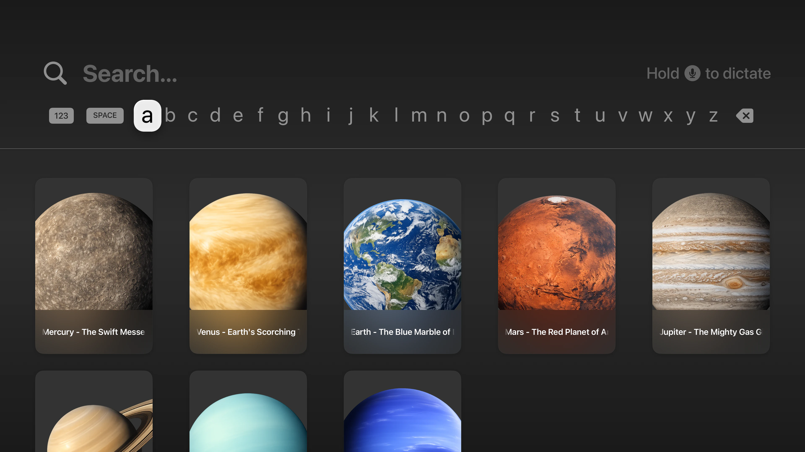
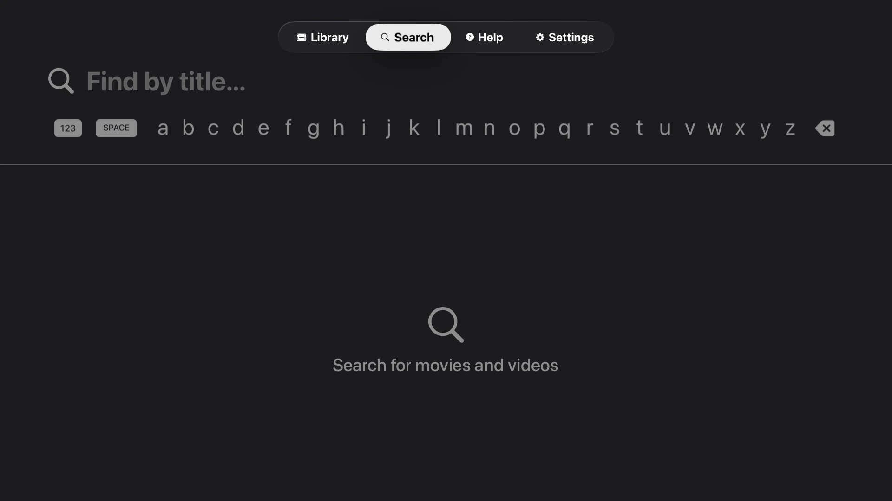
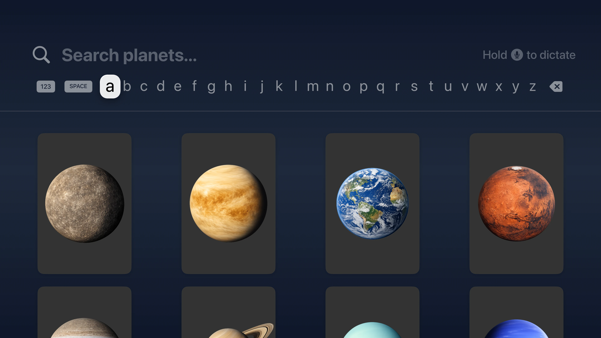
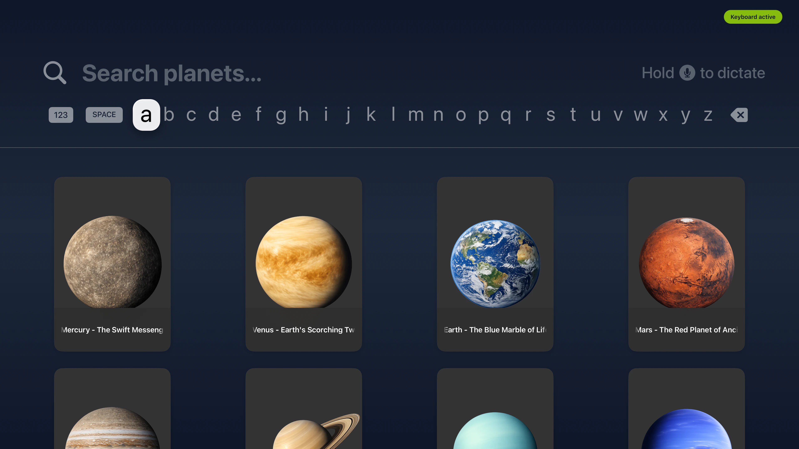
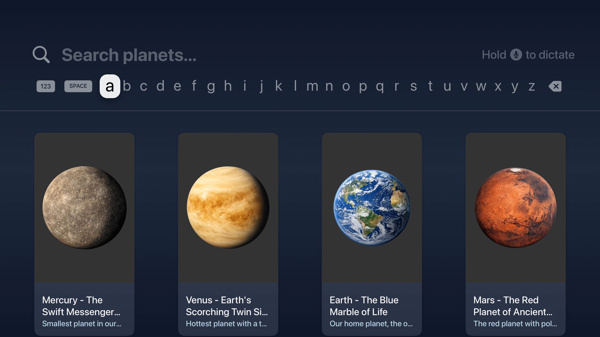
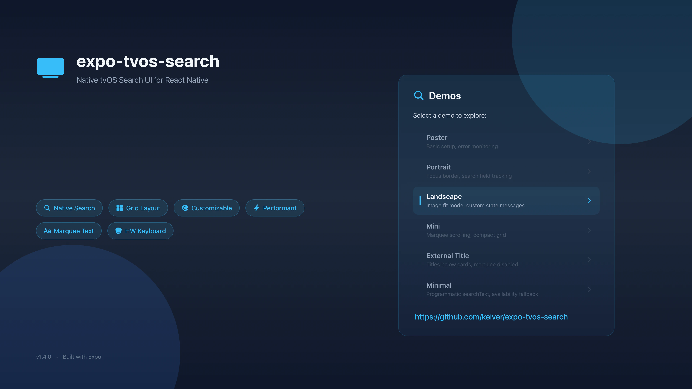
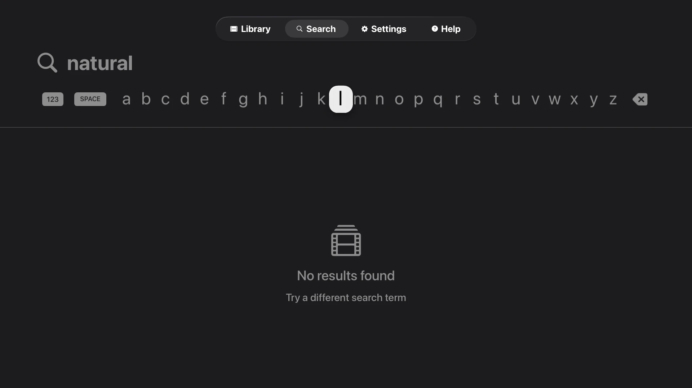
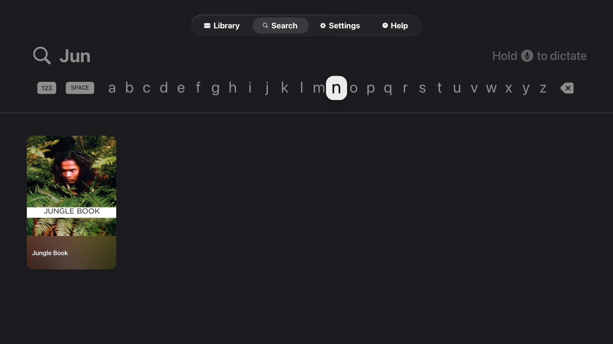
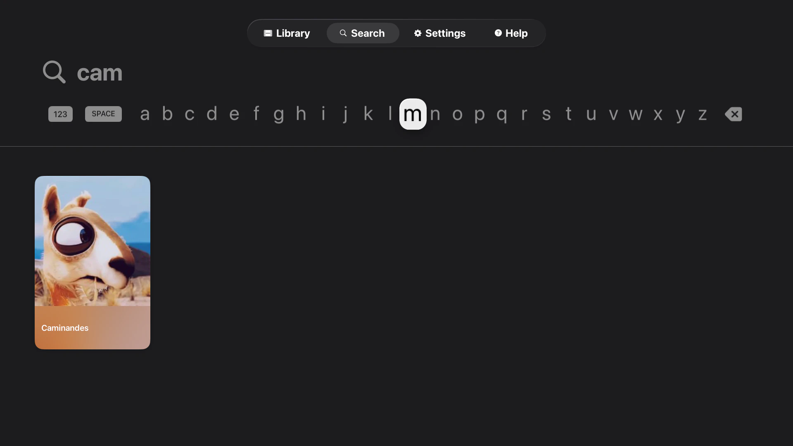

# expo-tvos-search — Native tvOS Search for React Native tvOS (Expo)

[](https://www.npmjs.com/package/expo-tvos-search)
[](https://opensource.org/licenses/MIT)
[](https://github.com/keiver/expo-tvos-search/actions)

A native Apple TV search component built with SwiftUI's `.searchable` modifier. Drop it into your Expo tvOS app and get the system search experience — keyboard, Siri Remote, focus handling — out of the box.

## Features

- **Native SwiftUI** — uses `.searchable` for the real tvOS search experience, not a web imitation
- **Siri Remote support** — full keyboard navigation, swipe, tap, and long-press handling on real hardware
- **Configurable grid** — portrait, landscape, square, or mini cards with adjustable columns, spacing, and padding
- **Marquee titles** — long titles auto-scroll on focus with configurable delay
- **Image caching** — async image loading with NSCache-backed caching
- **Title overlay** — gradient overlay with blur effect on card images, toggleable
- **External titles** — show title and subtitle below cards instead of (or alongside) the overlay
- **Customizable colors** — text color, accent/focus color, all via hex strings
- **Color scheme override** — force dark or light appearance regardless of system setting
- **Controlled search text** — set search field text programmatically for deep links, state restore, or "search for similar" flows
- **Error & validation callbacks** — structured error events and non-fatal validation warnings
- **Focus callbacks** — `onSearchFieldFocused` / `onSearchFieldBlurred` for gesture handler coordination
- **Platform-safe** — renders `null` on non-tvOS platforms; use `isNativeSearchAvailable()` to gate rendering

## Table of Contents

- [Installation](#installation)
- [Prerequisites](#prerequisites-for-tvos-builds)
- [Quick Start](#quick-start)
- [Usage Examples](#usage-examples)
  - [Portrait Cards](#portrait-cards)
  - [Landscape Cards](#landscape-cards)
  - [Mini Grid](#mini-grid)
  - [External Titles](#external-titles)
  - [Title Overlay Customization](#title-overlay-customization)
  - [Layout Spacing](#layout-spacing)
  - [Image Display Mode](#image-display-mode)
  - [Color Scheme Override](#color-scheme-override)
  - [Colors and Dimensions](#colors-and-dimensions)
  - [Error Handling](#error-handling)
  - [Apple TV Hardware Keyboard](#apple-tv-hardware-keyboard-support)
- [API Reference](#api-reference)
  - [Props](#props)
  - [SearchResult](#searchresult)
  - [Event Types](#event-types)
  - [isNativeSearchAvailable()](#isnativesearchavailable)
- [Result Validation](#result-validation)
- [Demo App](#demo-app)
- [Testing](#testing)
- [Contributing](#contributing)
- [License](#license)

<p align="center">
  
</p>

## Installation

```bash
npx expo install expo-tvos-search
```

Or install from GitHub:

```bash
npx expo install github:keiver/expo-tvos-search
```

## Prerequisites for tvOS Builds

Your project must be configured for React Native tvOS.

**Platform requirements:** tvOS 15.0+, Expo SDK 51+, React Native tvOS 0.71+

### 1. Install react-native-tvos

```bash
npm install react-native-tvos@latest
```

### 2. Install the tvOS config plugin

```bash
npx expo install @react-native-tvos/config-tv
```

Then add the plugin in `app.json` / `app.config.js`:

```json
{
  "expo": {
    "plugins": ["@react-native-tvos/config-tv"]
  }
}
```

## Quick Start

```tsx
import { TvosSearchView, type SearchResult } from 'expo-tvos-search';

const results: SearchResult[] = [
  {
    id: 'earth',
    title: 'Earth',
    subtitle: 'The Blue Marble',
    imageUrl: 'https://example.com/earth.jpg',
  },
  {
    id: 'mars',
    title: 'Mars',
    subtitle: 'The Red Planet',
    imageUrl: 'https://example.com/mars.jpg',
  },
];

export default function SearchScreen() {
  return (
    <TvosSearchView
      results={results}
      columns={4}
      placeholder="Search planets..."
      isLoading={false}
      topInset={80}
      onSearch={(e) => console.log('Search:', e.nativeEvent.query)}
      onSelectItem={(e) => console.log('Selected:', e.nativeEvent.id)}
      textColor="#E5E5E5"
      accentColor="#E50914"
      cardWidth={280}
      cardHeight={420}
      overlayTitleSize={18}
      style={{ flex: 1 }}
    />
  );
}
```

### Apple TV Hardware Keyboard Support

On real Apple TV hardware, React Native's `RCTTVRemoteHandler` installs gesture recognizers that consume Siri Remote presses before they reach SwiftUI's `.searchable` text field, which prevents keyboard input. When the search field gains focus, this component temporarily disables touch cancellation using the official `react-native-tvos` notification API, and also disables tap/long-press recognizers from parent views (to cover cases like `react-native-gesture-handler`). Swipe and pan recognizers stay active for keyboard navigation. Everything is restored when focus leaves the field. This only applies to physical devices — the Simulator doesn't need it.

If this interferes with gesture handling in your app, please [open an issue](https://github.com/keiver/expo-tvos-search/issues) so we can sort it out.

For additional control, you can use the focus callbacks with `TVEventControl`:

```tsx
import { TVEventControl } from 'react-native';

<TvosSearchView
  onSearchFieldFocused={() => {
    TVEventControl.disableGestureHandlersCancelTouches();
  }}
  onSearchFieldBlurred={() => {
    TVEventControl.enableGestureHandlersCancelTouches();
  }}
  // ... other props
/>
```


### Color Scheme Override

Apps with a fixed dark background can get illegible search bar text when the system is in light mode. Use `colorScheme` to force a specific appearance:

```tsx
<TvosSearchView
  colorScheme="dark"
  // ... other props
/>
```

- `"dark"` — white text, dark UI elements (good for dark-background apps)
- `"light"` — black text, light UI elements
- `"system"` — follows the device setting (default, no override)

## API Reference

### Props

#### Core

| Prop | Type | Default | Description |
|------|------|---------|-------------|
| `results` | `SearchResult[]` | `[]` | Array of search results to display. Capped at 500 items. |
| `columns` | `number` | `5` | Number of grid columns (clamped 1–10) |
| `placeholder` | `string` | `"Search..."` | Search field placeholder text |
| `searchText` | `string` | — | Programmatically set search field text (for deep links, state restore) |
| `isLoading` | `boolean` | `false` | Shows a loading indicator |

#### Card Dimensions & Spacing

| Prop | Type | Default | Description |
|------|------|---------|-------------|
| `cardWidth` | `number` | `280` | Width of each result card in points (clamped 50–1000) |
| `cardHeight` | `number` | `420` | Height of each result card in points (clamped 50–1000) |
| `cardMargin` | `number` | `40` | Spacing between cards (horizontal and vertical, clamped 0–200) |
| `cardPadding` | `number` | `16` | Padding inside the card for overlay content (clamped 0–100) |
| `topInset` | `number` | `0` | Top padding for tab bar clearance (clamped 0–500) |

#### Display Options

| Prop | Type | Default | Description |
|------|------|---------|-------------|
| `showTitle` | `boolean` | `false` | Show title below each result card |
| `showSubtitle` | `boolean` | `false` | Show subtitle below title |
| `showTitleOverlay` | `boolean` | `true` | Show title overlay with gradient at bottom of card |
| `showFocusBorder` | `boolean` | `false` | Show border on focused item |
| `imageContentMode` | `'fill' \| 'fit' \| 'contain'` | `'fill'` | How images fill the card: `fill` crops, `fit`/`contain` letterbox |

#### Styling & Colors

| Prop | Type | Default | Description |
|------|------|---------|-------------|
| `textColor` | `string` | system default | Color for text and UI elements (hex, e.g. `"#FFFFFF"`) |
| `accentColor` | `string` | `"#FFC312"` | Accent color for focused elements (hex, e.g. `"#E50914"`) |
| `colorScheme` | `'light' \| 'dark' \| 'system'` | `"system"` | Override the system color scheme for the search view |
| `overlayTitleSize` | `number` | `20` | Font size for title text in the blur overlay (clamped 8–72) |

#### Animation

| Prop | Type | Default | Description |
|------|------|---------|-------------|
| `enableMarquee` | `boolean` | `true` | Enable marquee scrolling for long titles |
| `marqueeDelay` | `number` | `1.5` | Delay in seconds before marquee starts (clamped 0–60) |

#### Text Customization

| Prop | Type | Default | Description |
|------|------|---------|-------------|
| `emptyStateText` | `string` | `"Search your library"` | Text shown when search field is empty |
| `searchingText` | `string` | `"Searching..."` | Text shown during search |
| `noResultsText` | `string` | `"No results found"` | Text shown when no results match |
| `noResultsHintText` | `string` | `"Try a different search term"` | Hint text below no results message |

#### Event Handlers

| Prop | Type | Required | Description |
|------|------|----------|-------------|
| `onSearch` | `(event: SearchEvent) => void` | Yes | Called when search text changes |
| `onSelectItem` | `(event: SelectItemEvent) => void` | Yes | Called when a result is selected |
| `onError` | `(event: SearchViewErrorEvent) => void` | No | Called on errors (image loading, validation) |
| `onValidationWarning` | `(event: ValidationWarningEvent) => void` | No | Called for non-fatal warnings (truncated fields, clamped values) |
| `onSearchFieldFocused` | `(event: SearchFieldFocusEvent) => void` | No | Called when native search field gains focus |
| `onSearchFieldBlurred` | `(event: SearchFieldFocusEvent) => void` | No | Called when native search field loses focus |

#### Other

| Prop | Type | Default | Description |
|------|------|---------|-------------|
| `style` | `ViewStyle` | — | Style object for the view container |

### SearchResult

```ts
interface SearchResult {
  id: string;        // Unique identifier (used in onSelectItem)
  title: string;     // Primary display text
  subtitle?: string; // Optional secondary text
  imageUrl?: string; // Optional poster/thumbnail URL (HTTPS, HTTP, or data: URI)
}
```

### isNativeSearchAvailable()

```ts
function isNativeSearchAvailable(): boolean
```

Returns `true` when running on tvOS with the native module properly built. Use this to conditionally render a fallback on non-tvOS platforms.

```tsx
import { TvosSearchView, isNativeSearchAvailable } from 'expo-tvos-search';

if (!isNativeSearchAvailable()) {
  return <FallbackSearch />;
}
return <TvosSearchView {...props} />;
```

## Result Validation

The native implementation applies the following constraints:

- **Maximum results** — the array is capped at 500 items; extras are silently ignored
- **Required fields** — results with empty `id` or `title` are filtered out
- **Image URL schemes** — HTTP, HTTPS, and `data:` URIs are accepted; other schemes (e.g. `file://`) are rejected
- **HTTPS recommended** — HTTP URLs may be blocked by App Transport Security unless explicitly allowed in Info.plist

## Demo App

Explore all configurations in the [expo-tvos-search-demo](https://github.com/keiver/expo-tvos-search-demo) repository.

## Testing

```bash
npm test                # Run tests once
npm run test:watch      # Watch mode
npm run test:coverage   # Generate coverage report
```

Tests cover:

- Behavior across platforms
- Component rendering when native module is unavailable
- Event structure validation

## Contributing

We welcome contributions! Please see [CONTRIBUTING.md](CONTRIBUTING.md) for guidelines on:

- Code of conduct
- Development setup
- Testing requirements
- Commit message conventions
- Pull request process

<table>
  <tr>
    <td></td>
    <td></td>
    <td></td>
  </tr>
  <tr>
    <td></td>
    <td></td>
    <td></td>
  </tr>
  <tr>
    <td></td>
    <td></td>
    <td></td>
  </tr>
</table>


## License

MIT — see [LICENSE](LICENSE) for details.
