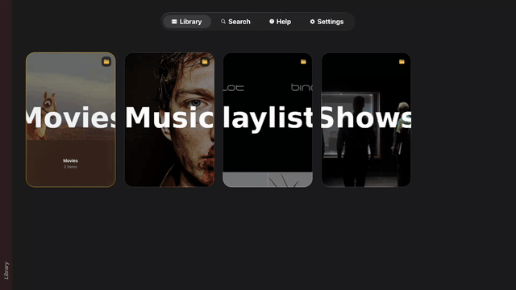

# expo-tvos-search

[](https://www.npmjs.com/package/expo-tvos-search)
[](https://opensource.org/licenses/MIT)
[](https://github.com/keiver/expo-tvos-search/actions)
[](https://bundlephobia.com/package/expo-tvos-search)

A native tvOS search component for Expo and React Native using SwiftUI's `.searchable` modifier. Handles focus, keyboard navigation, and accessibility out of the box.

<p align="center">
  
</p>

<table>
  <tr>
    <td align="center">
      <br/>
      <sub>Native Search</sub>
    </td>
    <td align="center">
      <br/>
      <sub>Results</sub>
    </td>
    <td align="center">
      <br/>
      <sub>Empty State</sub>
    </td>
  </tr>
</table>

## Installation

```bash
npx expo install expo-tvos-search
```

Or install from GitHub:

```bash
npx expo install github:keiver/expo-tvos-search
```

Then follow the **tvOS prerequisites** below and rebuild your native project.

## Prerequisites for tvOS Builds (Expo)

Your project must be configured for React Native tvOS to build and run this module.

**Quick Checklist:**

- ✅ `react-native-tvos` in use
- ✅ `@react-native-tvos/config-tv` installed + added to Expo plugins
- ✅ Run prebuild with `EXPO_TV=1`

### 1. Swap to react-native-tvos

Replace `react-native` with the [tvOS fork](https://github.com/react-native-tvos/react-native-tvos):

```bash
npm remove react-native && npm install react-native-tvos@latest
```

### 2. Install the tvOS config plugin

Install:

```bash
npx expo install @react-native-tvos/config-tv
```

Then add the plugin in `app.json` / `app.config.js`:

```json
{
  "expo": {
    "plugins": ["@react-native-tvos/config-tv"]
  }
}
```

### 3. Generate native projects with tvOS enabled

```bash
EXPO_TV=1 npx expo prebuild --clean
```

Then run:

```bash
npx expo run:ios
```

### 4. Common gotchas

- **Prebuild must be re-run** if you add/remove tvOS dependencies or change the tvOS plugin configuration.
- **If you see App Transport Security errors** for images, ensure your `imageUrl` uses `https://` (recommended) or add the appropriate ATS exceptions.
- **If the tvOS keyboard/search UI doesn't appear**, confirm you're actually running a tvOS target/simulator, not an iOS target.

## Usage

```tsx
import React, { useState } from "react";
import { Alert } from "react-native";
import {
  TvosSearchView,
  isNativeSearchAvailable,
  type SearchResult,
} from "expo-tvos-search";

const PLANETS: SearchResult[] = [
  { id: "mercury", title: "Mercury", subtitle: "Smallest planet", imageUrl: "https://upload.wikimedia.org/wikipedia/commons/thumb/4/4a/Mercury_in_true_color.jpg/400px-Mercury_in_true_color.jpg" },
  { id: "venus", title: "Venus", subtitle: "Hottest planet", imageUrl: "https://upload.wikimedia.org/wikipedia/commons/thumb/e/e5/Venus-real_color.jpg/400px-Venus-real_color.jpg" },
  { id: "earth", title: "Earth", subtitle: "Our home", imageUrl: "https://upload.wikimedia.org/wikipedia/commons/thumb/9/97/The_Earth_seen_from_Apollo_17.jpg/400px-The_Earth_seen_from_Apollo_17.jpg" },
  { id: "mars", title: "Mars", subtitle: "The red planet", imageUrl: "https://upload.wikimedia.org/wikipedia/commons/thumb/0/02/OSIRIS_Mars_true_color.jpg/400px-OSIRIS_Mars_true_color.jpg" },
  { id: "jupiter", title: "Jupiter", subtitle: "Largest planet", imageUrl: "https://upload.wikimedia.org/wikipedia/commons/thumb/c/c1/Jupiter_New_Horizons.jpg/400px-Jupiter_New_Horizons.jpg" },
  { id: "saturn", title: "Saturn", subtitle: "Ringed giant", imageUrl: "https://upload.wikimedia.org/wikipedia/commons/thumb/c/c7/Saturn_during_Equinox.jpg/400px-Saturn_during_Equinox.jpg" },
  { id: "uranus", title: "Uranus", subtitle: "Ice giant", imageUrl: "https://upload.wikimedia.org/wikipedia/commons/thumb/3/3d/Uranus2.jpg/400px-Uranus2.jpg" },
  { id: "neptune", title: "Neptune", subtitle: "Windiest planet", imageUrl: "https://upload.wikimedia.org/wikipedia/commons/thumb/6/63/Neptune_-_Voyager_2_%2829347980845%29_flatten_crop.jpg/400px-Neptune_-_Voyager_2_%2829347980845%29_flatten_crop.jpg" },
];

export function SearchScreen() {
  const [results, setResults] = useState<SearchResult[]>([]);
  const [isLoading, setIsLoading] = useState(false);

  const handleSearch = (event: { nativeEvent: { query: string } }) => {
    const { query } = event.nativeEvent;

    if (!query.trim()) {
      setResults([]);
      return;
    }

    setIsLoading(true);

    // Simulate async search
    setTimeout(() => {
      const filtered = PLANETS.filter((planet) =>
        planet.title.toLowerCase().includes(query.toLowerCase()) ||
        planet.subtitle?.toLowerCase().includes(query.toLowerCase())
      );
      setResults(filtered);
      setIsLoading(false);
    }, 300);
  };

  const handleSelect = (event: { nativeEvent: { id: string } }) => {
    const planet = PLANETS.find((p) => p.id === event.nativeEvent.id);
    if (planet) {
      Alert.alert(planet.title, planet.subtitle);
    }
  };

  if (!isNativeSearchAvailable()) {
    return <YourFallbackSearch />;
  }

  return (
    <TvosSearchView
      results={results}
      columns={5}
      placeholder="Search planets..."
      isLoading={isLoading}
      topInset={140}
      onSearch={handleSearch}
      onSelectItem={handleSelect}
      style={{ flex: 1 }}
    />
  );
}
```

## Example App

**[Tomo TV](https://github.com/keiver/tomotv)** is a production tvOS application that uses `expo-tvos-search` in a real-world Jellyfin client. It demonstrates the search component integrated with a complete media browsing experience, including:

- Search interaction with tvOS remote
- Focus navigation through results
- Integration with a live media library
- Complete setup instructions and screenshots

Check out Tomo TV to see `expo-tvos-search` in action and reference its implementation for your own projects.

## See it in action:

<p align="center">
  
</p>

## Props

| Prop | Type | Default | Description |
|------|------|---------|-------------|
| `results` | `SearchResult[]` | `[]` | Array of search results |
| `columns` | `number` | `5` | Number of columns in the grid |
| `placeholder` | `string` | `"Search..."` | Search field placeholder |
| `isLoading` | `boolean` | `false` | Shows loading indicator |
| `showTitle` | `boolean` | `false` | Show title below each result |
| `showSubtitle` | `boolean` | `false` | Show subtitle below title |
| `showFocusBorder` | `boolean` | `false` | Show border on focused item |
| `topInset` | `number` | `0` | Top padding (for tab bar clearance) |
| `showTitleOverlay` | `boolean` | `true` | Show title overlay with gradient at bottom of card |
| `enableMarquee` | `boolean` | `true` | Enable marquee scrolling for long titles |
| `marqueeDelay` | `number` | `1.5` | Delay in seconds before marquee starts |
| `emptyStateText` | `string` | `"Search for movies and videos"` | Text shown when search field is empty |
| `searchingText` | `string` | `"Searching..."` | Text shown during search |
| `noResultsText` | `string` | `"No results found"` | Text shown when no results found |
| `noResultsHintText` | `string` | `"Try a different search term"` | Hint text below no results message |
| `onSearch` | `function` | required | Called when search text changes |
| `onSelectItem` | `function` | required | Called when result is selected |

## SearchResult Type

```typescript
interface SearchResult {
  id: string;
  title: string;
  subtitle?: string;
  imageUrl?: string;
}
```

## Result Handling

The native implementation applies the following validation and constraints:

- **Maximum results**: The results array is capped at 500 items. Any results beyond this limit are silently ignored.
- **Required fields**: Results with empty `id` or `title` are automatically filtered out and not displayed.
- **Image URL schemes**: Only HTTP and HTTPS URLs are accepted for `imageUrl`. Other URL schemes (e.g., `file://`, `data:`) are rejected.
- **HTTPS recommended**: HTTP URLs may be blocked by App Transport Security on tvOS unless explicitly allowed in Info.plist.

## Focus Handling - Do's and Don'ts

The native `.searchable` modifier manages focus automatically. Here's what to do and what to avoid:

### ✅ Do: Render directly in your screen

```tsx
function SearchScreen() {
  return (
    <TvosSearchView
      results={results}
      onSearch={handleSearch}
      onSelectItem={handleSelect}
      style={{ flex: 1 }}
    />
  );
}
```

### ❌ Don't: Wrap in focusable containers

```tsx
// ❌ WRONG - breaks focus navigation
function SearchScreen() {
  return (
    <Pressable>  {/* Don't wrap in Pressable */}
      <TvosSearchView ... />
    </Pressable>
  );
}

// ❌ WRONG - interferes with native focus
function SearchScreen() {
  return (
    <TouchableOpacity>  {/* Don't wrap in TouchableOpacity */}
      <TvosSearchView ... />
    </TouchableOpacity>
  );
}
```

**Why this breaks**: Focusable wrappers steal focus from the native SwiftUI search container, which breaks directional navigation.

### ✅ Do: Use non-interactive containers

```tsx
// ✅ CORRECT - View is not focusable
function SearchScreen() {
  return (
    <View style={{ flex: 1, backgroundColor: '#000' }}>
      <TvosSearchView ... />
    </View>
  );
}

// ✅ CORRECT - SafeAreaView is not focusable
function SearchScreen() {
  return (
    <SafeAreaView style={{ flex: 1 }}>
      <TvosSearchView ... />
    </SafeAreaView>
  );
}
```

## Requirements

- Node.js 18+
- Expo SDK 51+
- tvOS 15+
- Project configured for tvOS (`react-native-tvos` + `@react-native-tvos/config-tv`)

## Troubleshooting

### Native module not found

If you see `requireNativeViewManager("ExpoTvosSearch") returned null`, the native module hasn't been built:

```bash
# Clean and rebuild with tvOS support
EXPO_TV=1 npx expo prebuild --clean
npx expo run:ios
```

**Note:** Expo Go doesn't support this. Build a dev client or native build instead.

### Images not loading

1. Verify your image URLs are HTTPS (HTTP may be blocked by App Transport Security)
2. Ensure required authentication parameters are included in image URLs
3. For local development, ensure your server is accessible from the Apple TV

### Focus issues

If focus doesn't move correctly:

1. Ensure `columns` prop matches your layout (default: 5)
2. Check `topInset` if the first row is hidden under the tab bar
3. The native `.searchable` modifier handles focus automatically - avoid wrapping in focusable containers

### Marquee not scrolling

If long titles don't scroll when focused:

1. Verify `enableMarquee={true}` (default)
2. Check `marqueeDelay` - scrolling starts after this delay (default: 1.5s)
3. Text only scrolls if it overflows the card width

## Testing

Run TypeScript tests:

```bash
npm test                # Run tests once
npm run test:watch      # Watch mode
npm run test:coverage   # Generate coverage report
```

Tests cover:
- `isNativeSearchAvailable()` behavior on different platforms
- Component rendering when native module is unavailable
- Event structure validation

## License

MIT