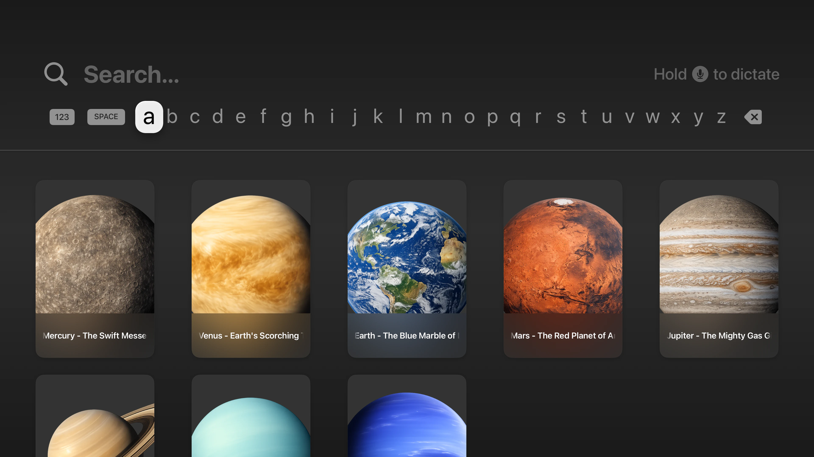
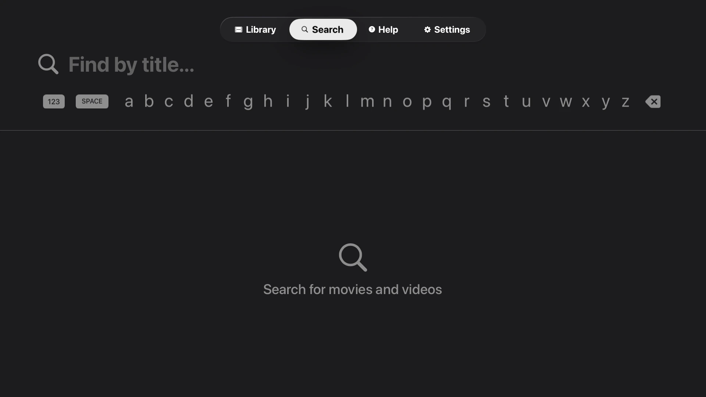
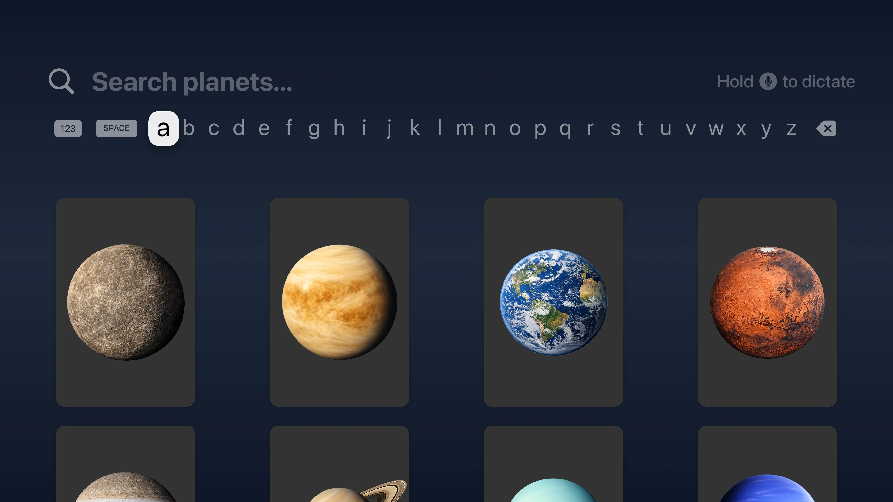
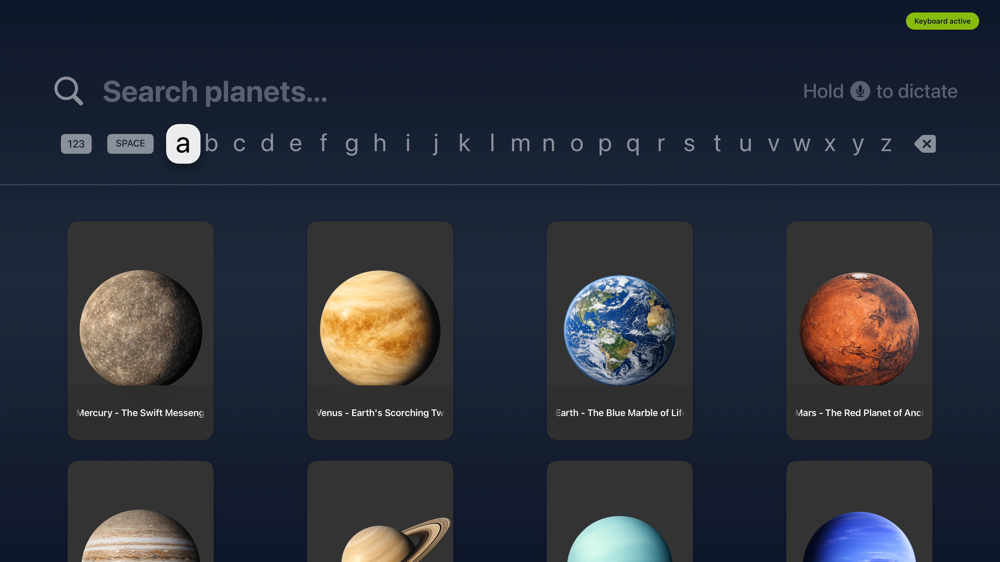
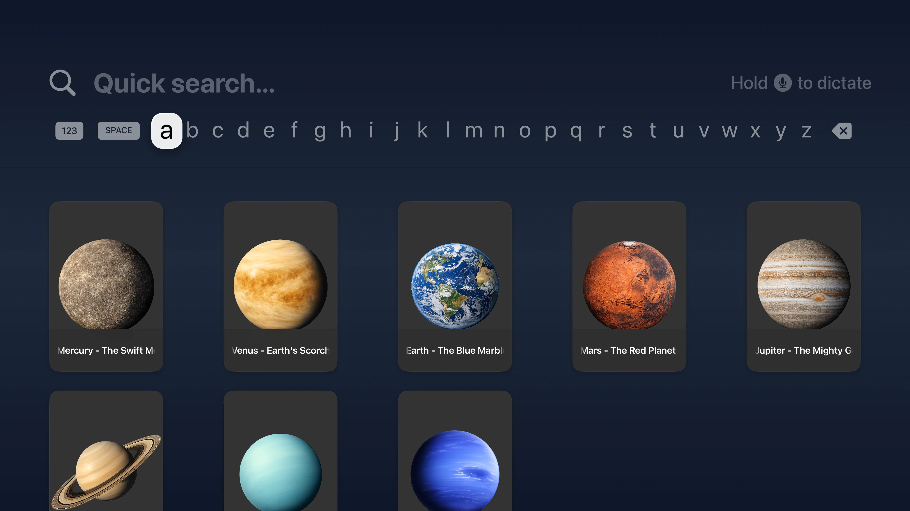
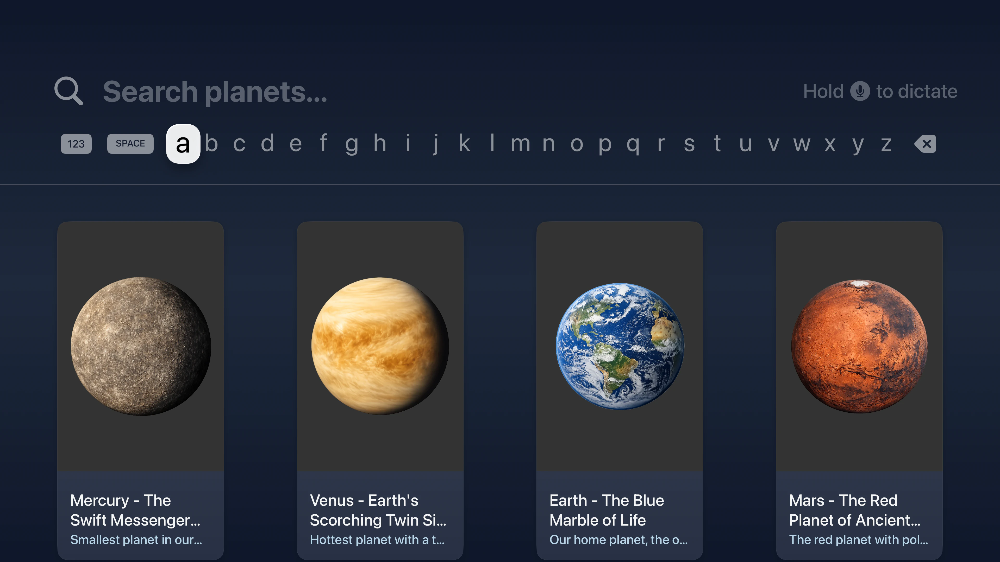
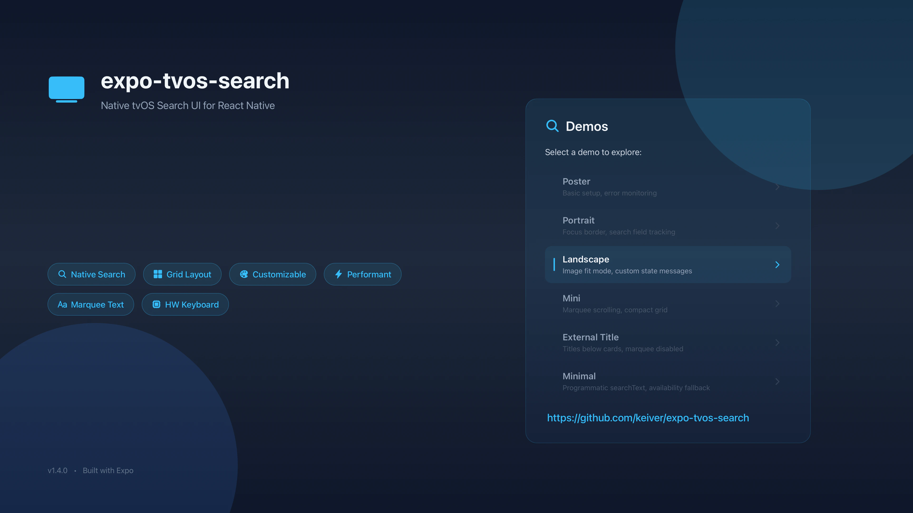
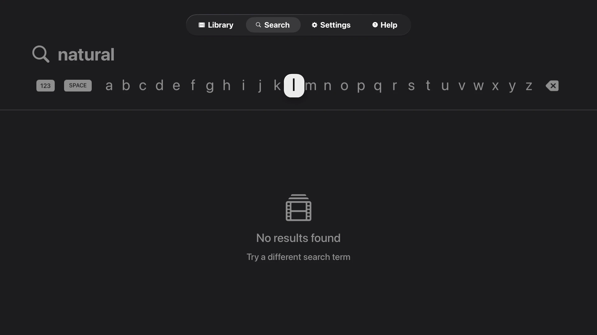
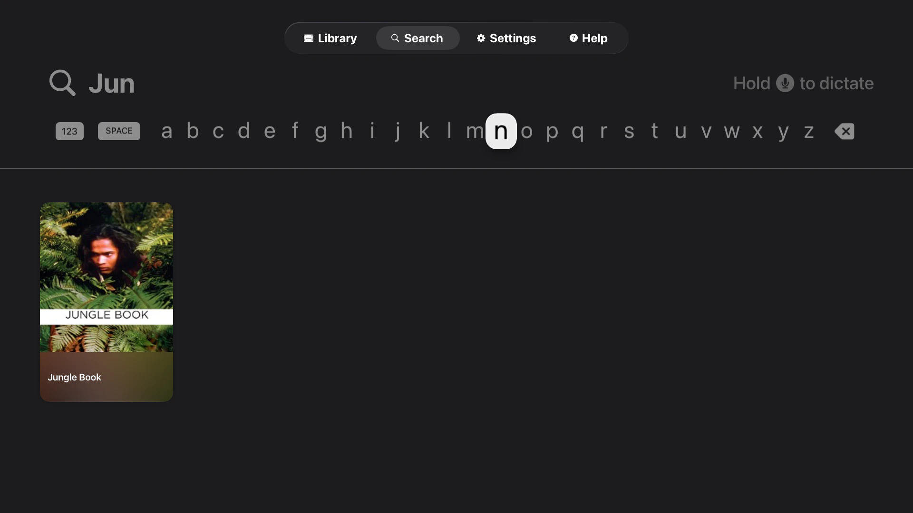
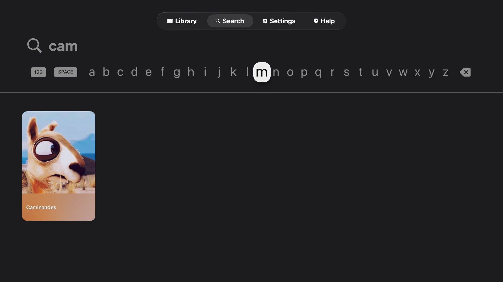

# expo-tvos-search

[](https://www.npmjs.com/package/expo-tvos-search)
[](https://opensource.org/licenses/MIT)
[](https://github.com/keiver/expo-tvos-search/actions)

A native Apple TV search component built with SwiftUI's `.searchable` modifier. Drop it into your Expo tvOS app and get the system search experience (keyboard, Siri Remote, focus handling) out of the box.

## Features

- Native SwiftUI `.searchable`, not a web imitation
- Full Siri Remote support: keyboard, swipe, tap, long press
- Configurable grid: portrait, landscape, square, or mini cards
- Fully styleable cards: corner radius, borders, focus glow, overlay colors
- Marquee titles that scroll on focus, in loop or bounce mode
- NSCache-backed async image loading
- Error and validation callbacks
- Renders `null` off tvOS, gated by `isNativeSearchAvailable()`

<p align="center">
  
</p>

## Installation

```bash
npx expo install expo-tvos-search
```

Or from GitHub:

```bash
npx expo install github:keiver/expo-tvos-search
```

## Prerequisites

Requires tvOS 15.0+, Expo SDK 51+, React Native tvOS 0.71+.

```bash
npm install react-native-tvos@latest
npx expo install @react-native-tvos/config-tv
```

Then add the plugin to `app.json`:

```json
{
  "expo": {
    "plugins": ["@react-native-tvos/config-tv"]
  }
}
```

## Usage

Only `results`, `onSearch`, and `onSelectItem` are required. Everything else is optional and defaults to the values shown in the [API Reference](#api-reference).

This example passes every available prop, so you can delete what you don't need:

```tsx
import { TvosSearchView, isNativeSearchAvailable, type SearchResult } from 'expo-tvos-search';
import { useState } from 'react';

export default function SearchScreen() {
  const [results, setResults] = useState<SearchResult[]>([]);
  const [isLoading, setIsLoading] = useState(false);

  if (!isNativeSearchAvailable()) {
    return <FallbackSearch />;
  }

  return (
    <TvosSearchView
      // Core
      results={results}
      columns={5}
      placeholder="Search..."
      searchText={undefined}
      isLoading={isLoading}

      // Card dimensions and spacing
      cardWidth={280}
      cardHeight={420}
      cardMargin={40}
      cardPadding={16}
      cardCornerRadius={12}
      topInset={80}

      // Display options
      showTitle={false}
      showSubtitle={false}
      showTitleOverlay={true}
      showFocusBorder={false}
      imageContentMode="fill"

      // Colors
      textColor="#E5E5E5"
      accentColor="#FFC312"
      colorScheme="dark"
      cardBackgroundColor="#1C1C1E"
      borderWidth={0}
      borderColor="#26FFFFFF"

      // Focus appearance
      focusStyle="system"
      focusBorderWidth={4}
      focusScale={1}
      focusGlowColor="#FFC312"
      focusGlowOpacity={0.55}
      focusGlowRadius={0}

      // Title overlay
      overlayTitleSize={20}
      overlayTitleWeight="semibold"
      overlayHeight={46}
      overlayBackgroundColor={undefined}
      overlayTextColor="#FFFFFF"
      overlayBackgroundColorFocused="#FFC312"
      overlayTextColorFocused="#2B1F05"

      // Marquee
      enableMarquee={true}
      marqueeDelay={1.5}
      marqueeSpeed={30}
      marqueeMode="loop"

      // State text
      emptyStateText="Search your library"
      searchingText="Searching..."
      noResultsText="No results found"
      noResultsHintText="Try a different search term"

      // Events
      onSearch={(e) => console.log('Search:', e.nativeEvent.query)}
      onSelectItem={(e) => console.log('Selected:', e.nativeEvent.id)}
      onError={(e) => console.warn(e.nativeEvent.category, e.nativeEvent.message)}
      onValidationWarning={(e) => console.warn(e.nativeEvent.type, e.nativeEvent.message)}
      onSearchFieldFocused={() => {}}
      onSearchFieldBlurred={() => {}}

      style={{ flex: 1 }}
    />
  );
}
```

### Matching a custom card design

To make native cards match a card you already render in JS, set `focusStyle="custom"`. Left on `"system"`, tvOS adds its own lift, parallax, and shadow on top of your border and glow.

Setting `overlayBackgroundColor` replaces the native blur material with a solid fill. A translucent color composited over the blur muddies both, so the overlay uses one or the other.

### Long press on a card

tvOS gives a focused SwiftUI button no long press of its own, so `enableLongPress` installs a select press recognizer on the view and reports the card the focus engine is on.

```tsx
<TvosSearchView
  results={results}
  enableLongPress
  onSelectItem={(e) => play(e.nativeEvent.id)}
  onLongSelectItem={(e) => openActions(e.nativeEvent.id)}
  onSearch={handleSearch}
/>
```

Holding select fires `onLongSelectItem` after 0.5 seconds and drops the select that ends the hold, so one press never does both. The recognizer is off while the search field is being typed into, and off entirely without `enableLongPress`.

### Apple TV hardware keyboard

On real hardware, React Native's `RCTTVRemoteHandler` installs gesture recognizers that consume Siri Remote presses before they reach the search field. When the field gains focus this component temporarily disables touch cancellation and parent tap/long-press recognizers, then restores them on blur. Swipe and pan stay active. The Simulator does not need this.

If it interferes with your gestures, [open an issue](https://github.com/keiver/expo-tvos-search/issues). For manual control, use `onSearchFieldFocused` and `onSearchFieldBlurred` with `TVEventControl`.

## API Reference

### Core

| Prop | Type | Default | Description |
|------|------|---------|-------------|
| `results` | `SearchResult[]` | `[]` | Results to display. Capped at 500 items |
| `columns` | `number` | `5` | Grid columns (clamped 1 to 10) |
| `placeholder` | `string` | `"Search..."` | Search field placeholder |
| `searchText` | `string` | none | Set the field text programmatically, for deep links or state restore |
| `isLoading` | `boolean` | `false` | Shows a loading indicator |
| `style` | `ViewStyle` | none | Style for the view container |

### Card dimensions and spacing

| Prop | Type | Default | Description |
|------|------|---------|-------------|
| `cardWidth` | `number` | `280` | Card width in points (clamped 50 to 1000) |
| `cardHeight` | `number` | `420` | Card height in points (clamped 50 to 1000) |
| `cardMargin` | `number` | `40` | Spacing between cards, both axes (clamped 0 to 200) |
| `cardPadding` | `number` | `16` | Padding inside the card for overlay content (clamped 0 to 100) |
| `cardCornerRadius` | `number` | `12` | Card corner radius in points (clamped 0 to 100) |
| `topInset` | `number` | `0` | Top padding for tab bar clearance (clamped 0 to 500) |

### Display options

| Prop | Type | Default | Description |
|------|------|---------|-------------|
| `showTitle` | `boolean` | `false` | Show the title below each card |
| `showSubtitle` | `boolean` | `false` | Show the subtitle below the title |
| `showTitleOverlay` | `boolean` | `true` | Show the title bar over the bottom of the image |
| `showFocusBorder` | `boolean` | `false` | Show a border on the focused card |
| `imageContentMode` | `'fill' \| 'fit' \| 'contain'` | `'fill'` | `fill` crops, `fit` and `contain` letterbox |

### Colors

| Prop | Type | Default | Description |
|------|------|---------|-------------|
| `textColor` | `string` | system | Text and UI color, hex |
| `accentColor` | `string` | `"#FFC312"` | Accent color for focused elements, hex |
| `colorScheme` | `'light' \| 'dark' \| 'system'` | `"system"` | Force an appearance regardless of the system setting |
| `cardBackgroundColor` | `string` | dark gray | Shown behind the image, and wherever the image does not cover the card |
| `borderWidth` | `number` | `0` | Border drawn on every card, focused or not (clamped 0 to 20) |
| `borderColor` | `string` | transparent | Resting border color. 8 digit `AARRGGBB` hex is supported, e.g. `"#26FFFFFF"` |

Borders are drawn inside the card bounds, like a CSS `border-box` border.

### Focus appearance

| Prop | Type | Default | Description |
|------|------|---------|-------------|
| `focusStyle` | `'system' \| 'custom'` | `'system'` | `system` uses Apple's card lift, parallax, and shadow. `custom` applies only this library's border, glow, and scale |
| `focusBorderWidth` | `number` | `4` | Focused border width, used when `showFocusBorder` is true (clamped 0 to 20) |
| `focusScale` | `number` | `1` | Scale of the focused card. Only used when `focusStyle` is `custom` (clamped 1 to 1.5) |
| `focusGlowColor` | `string` | `accentColor` | Glow color around the focused card |
| `focusGlowOpacity` | `number` | `0.55` | Glow opacity (clamped 0 to 1) |
| `focusGlowRadius` | `number` | `0` | Glow blur radius. `0` disables it (clamped 0 to 60) |

`focusStyle` is ignored on tvOS 16 and earlier, which always takes the custom path. The system card style conflicts with React Native's remote gesture handler there.

### Title overlay

| Prop | Type | Default | Description |
|------|------|---------|-------------|
| `overlayTitleSize` | `number` | `20` | Overlay title font size (clamped 8 to 72) |
| `overlayTitleWeight` | `'regular' \| 'medium' \| 'semibold' \| 'bold' \| 'heavy'` | `'semibold'` | Overlay title font weight |
| `overlayHeight` | `number` | 25% of `cardHeight` | Overlay height in points (clamped 0 to 500) |
| `overlayBackgroundColor` | `string` | blur material | Setting it replaces the native blur with a solid fill |
| `overlayTextColor` | `string` | `"#FFFFFF"` | Overlay text color |
| `overlayBackgroundColorFocused` | `string` | `overlayBackgroundColor` | Overlay background while focused |
| `overlayTextColorFocused` | `string` | `overlayTextColor` | Overlay text color while focused |

### Marquee

| Prop | Type | Default | Description |
|------|------|---------|-------------|
| `enableMarquee` | `boolean` | `true` | Scroll long titles on focus |
| `marqueeDelay` | `number` | `1.5` | Seconds before scrolling starts (clamped 0 to 60) |
| `marqueeSpeed` | `number` | `30` | Scroll speed in points per second (clamped 5 to 300) |
| `marqueeMode` | `'loop' \| 'bounce'` | `'loop'` | `loop` scrolls continuously and repeats. `bounce` scrolls to the end, pauses, then scrolls back |

### Long press

| Prop | Type | Default | Description |
|------|------|---------|-------------|
| `enableLongPress` | `boolean` | `false` | Fire `onLongSelectItem` when select is held on the focused card |

### State text

| Prop | Type | Default |
|------|------|---------|
| `emptyStateText` | `string` | `"Search your library"` |
| `searchingText` | `string` | `"Searching..."` |
| `noResultsText` | `string` | `"No results found"` |
| `noResultsHintText` | `string` | `"Try a different search term"` |

### Events

| Prop | Type | Required | Description |
|------|------|----------|-------------|
| `onSearch` | `(event: SearchEvent) => void` | Yes | Search text changed. Debounce this |
| `onSelectItem` | `(event: SelectItemEvent) => void` | Yes | A result was selected |
| `onLongSelectItem` | `(event: LongSelectItemEvent) => void` | No | Select was held on the focused result. Needs `enableLongPress` |
| `onError` | `(event: SearchViewErrorEvent) => void` | No | Image loading or validation errors |
| `onValidationWarning` | `(event: ValidationWarningEvent) => void` | No | Non fatal warnings: truncated fields, clamped values |
| `onSearchFieldFocused` | `(event: SearchFieldFocusEvent) => void` | No | Search field gained focus |
| `onSearchFieldBlurred` | `(event: SearchFieldFocusEvent) => void` | No | Search field lost focus |

### SearchResult

```ts
interface SearchResult {
  id: string;        // Unique identifier, returned by onSelectItem
  title: string;     // Primary display text
  subtitle?: string; // Secondary text
  imageUrl?: string; // HTTPS, HTTP, file://, or data: URI
}
```

### isNativeSearchAvailable()

```ts
function isNativeSearchAvailable(): boolean
```

Returns `true` on tvOS with the native module built. Use it to render a fallback elsewhere.

## Result validation

The native side enforces these constraints and reports them through `onValidationWarning`:

- Results are capped at 500 items, extras are ignored
- Results with an empty `id` or `title` are skipped
- Image URLs must use `http`, `https`, `file`, or `data`. Other schemes are rejected
- `data:` URIs over 1 MB are rejected to avoid memory exhaustion
- Out of range numeric props are clamped, long strings are truncated at 500 characters

HTTPS is recommended. HTTP may be blocked by App Transport Security unless allowed in `Info.plist`.

## Demo app

See [expo-tvos-search-demo](https://github.com/keiver/expo-tvos-search-demo) for working examples of every configuration.

## Testing

```bash
npm test                # Run once
npm run test:watch      # Watch mode
npm run test:coverage   # Coverage report
```

## Contributing

See [CONTRIBUTING.md](CONTRIBUTING.md) for setup, testing requirements, and commit conventions.

<table>
  <tr>
    <td></td>
    <td></td>
    <td></td>
  </tr>
  <tr>
    <td></td>
    <td></td>
    <td></td>
  </tr>
  <tr>
    <td></td>
    <td></td>
    <td></td>
  </tr>
</table>

## License

MIT
